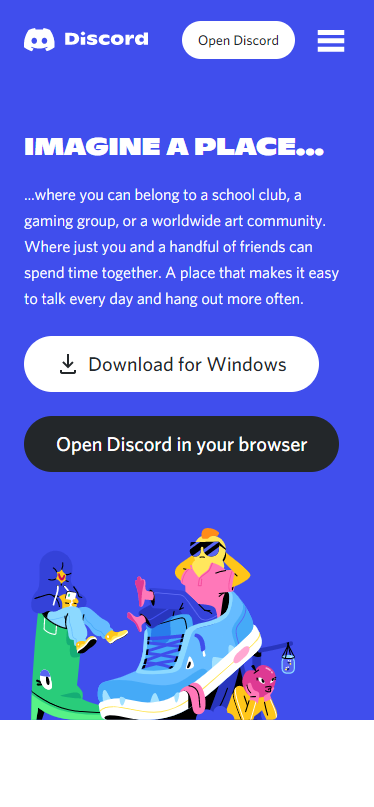
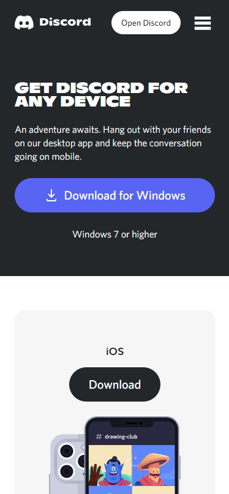
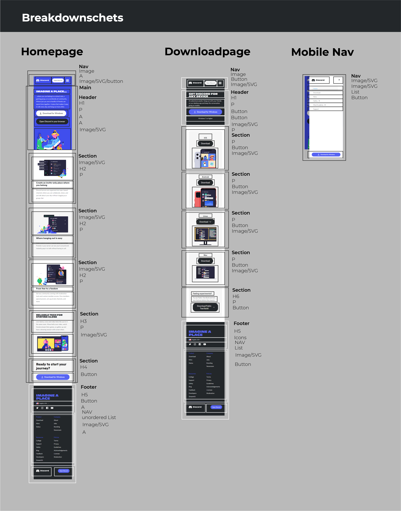
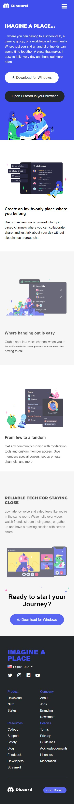
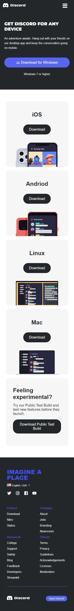
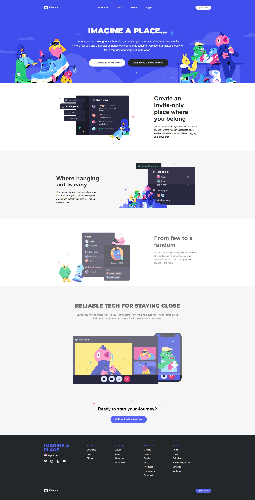
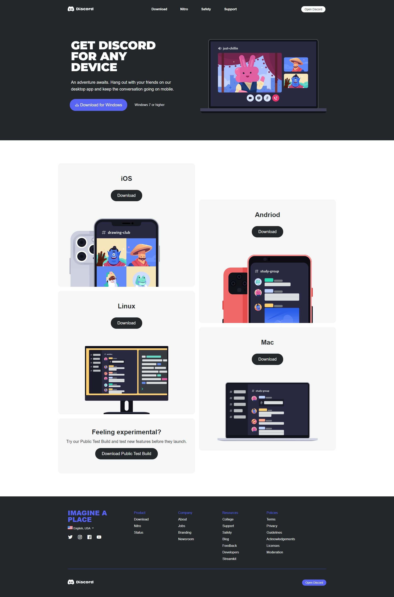

# Procesverslag
Markdown is een simpele manier om HTML te schrijven.  
Markdown cheat cheet: [Hulp bij het schrijven van Markdown](https://github.com/adam-p/markdown-here/wiki/Markdown-Cheatsheet).

Nb. De standaardstructuur en de spartaanse opmaak van de README.md zijn helemaal prima. Het gaat om de inhoud van je procesverslag. Besteedt de tijd voor pracht en praal aan je website.

Nb. Door *open* toe te voegen aan een *details* element kun je deze standaard open zetten. Fijn om dat steeds voor de relevante stuk(ken) te doen.

## Jij

uitwerken voor kick-off werkgroep

### Auteur:
Claudio Bakker

#### Je startniveau:
Zwart

#### Je focus:
Helemaal responsive
 

## Je website

uitwerken voor kick-off werkgroep

### Je opdracht:
link naar de website die je gaat namaken óf de naam/omschrijving van je eigen ontwerp:
https://discord.com/

#### Screenshot(s) van de eerste pagina (small screen): 
Discord | Your Place to Talk and Hang Out

#### Screenshot(s) van de tweede pagina (small screen):
Discord download pagina 

 

## Breakdownschets (week 1)

uitwerken na afloop 2e werkgroep

### de hele pagina: 

<!-- 

### dynamisch deel (bijv menu): 

### wellicht nog een dynamisch deel (bijv filter): 
 -->

## Voortgang 1 (week 2)

uitwerken voor 1e voortgang

### Stand van zaken

### Agenda voor meeting
samen met je groepje opstellen

| Vidar          | Claudio            | Leroy        | Ruben            |
| ---            | ---                | ---          | ---              |
|Moet je alles wat mogelijk is in custom properties? | Divjes en classes teveel?	| en ik dit    | en dan ik dat    |
|Classes zo op de juiste manier met sections? (nog bespreken?)| nog een punt | dit wil ik zeker |
| ...            | ...                | ...          | ...              |

### Verslag van meeting
hier na afloop snel de uitkomsten van de meeting vastleggen

- Divs en classes weg werken
- meer info opzoeken over psuedo-classes
- costum-properties gebruiken
- link gekregen voor de header images: https://codepen.io/shooft/pen/dyRveXL

## Voortgang 2 (week 3)

uitwerken voor 2e voortgang

### Stand van zaken
Costum-properties toegevoegd en verder bezig met herschrijven van de eerste pagina zonder divs, en classes.

### Agenda voor meeting
samen met je groepje opstellen

| student 1      | student 2          | student 3    | student 4        |
| ---            | ---                | ---          | ---              |
| Hoe animeer je het hamburger menu (voorbeeld zal ik laten zien)|Is het de bedoeling dat je de filters op de pagina ook werkend maakt? (Voorbeeld zal ik laten zien)|Hoe pas je de IntersectionObserver op de correcte manier toe in javascript| en dan ik dat    |
| Moet je ook custom properties met bijvoorbeeld white-space of is dat meer als aanbevolen?| nog een punt | dit wil ik zeker |
| Moet alles exact hetzelfde zijn als de website?| ...                | ...          | ...              |

### Verslag van meeting
hier na afloop snel de uitkomsten van de meeting vastleggen

- De huidige javascript code vervangen door de InterSectionObserver

## Toegankelijkheidstest (week 4)

uitwerken na test in 8e voortgang

### Bevindingen
Lijst met je bevindingen die in de test naar voren kwamen:

#### Hover states
Hover states van de buttons toevoegen.

Oplossing: Deze in de css toevoegen.

#### Active states. 
Active states toevoegen aan de buttons

Oplossing: deze toevoegen aan de css.

#### Focus tab. 
De focus tab functie werkte overal waar die moest werken.

#### Voice Over. 
Ook de vocie over werkte uitstekend.

## Voortgang 3 (week 4)

uitwerken voor 3e voortgang

### Stand van zaken

### Agenda voor meeting
samen met je groepje opstellen

| Vidar          | Claudio            | student 3    | student 4        |
| ---            | ---                | ---          | ---              |
| Enig idee hoe ik dit het beste kan aanpakken? (Laat ik zien) | Met javascript aanspreken van de mobile menu knop lukt nog niet helemaal.             | en ik dit    | en dan ik dat    |
| en dat ook nog | dit als er tijd is | nog een punt | dit wil ik zeker |
| ...            | ...                | ...          | ...              |

### Verslag van meeting
hier na afloop snel de uitkomsten van de meeting vastleggen

- De mobile menu doormiddel van CSS maken in plaats van Javascript
- PS. de docent heeft het probleem wat ik had met de mobile menu opgelost.

## Eindgesprek (week 5)

uitwerken voor eindgesprek

### Stand van zaken
Ik vond Front-end development over het algemeen redelijk goed gaan. Ik had op het eind wat moeite
met de mobile menu en footer, dit is uiteindelijk opgelost. De footer heb ik een paar keer moeten herschrijven
omdat ik het niet responsive kreeg, echter dit is uiteindelijk wel gelukt.

### Screenshot(s)

hier screenshot(s) van je eindresultaat

## Bronnenlijst

continu bijhouden terwijl je werkt

Nb. Wees specifiek ('css-tricks' als bron is bijv. niet specifiek genoeg).

1. bron 1
2. bron 2
3. ...

